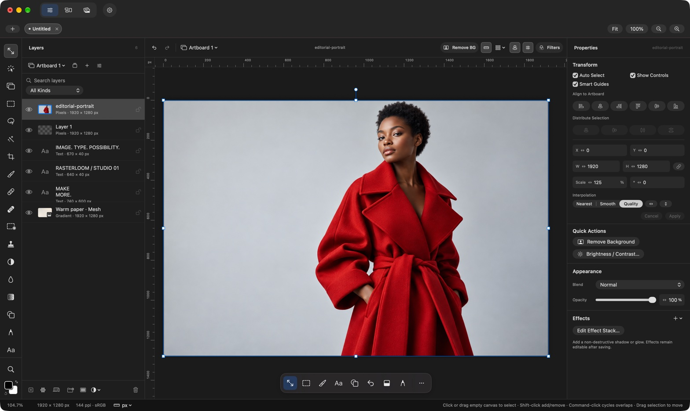

  

<h1 align="center">Rasterloom</h1>

  Image editing, moodboards, and a local asset library. 
  Made for Mac.

  <a href="https://github.com/lemberalla/Rasterloom/releases/download/v0.1.1/Rasterloom.dmg"><strong>Download 0.1.1 alpha</strong></a>
  &nbsp;·&nbsp;
  <a href="https://rasterloom.com/">Website</a>
  &nbsp;·&nbsp;
  <a href="https://github.com/lemberalla/Rasterloom/releases/tag/v0.1.1">Release notes</a>

Apple silicon · macOS 15 or later

### Make, collect, organize

- **Edit** with layers, editable text and vectors, gradients, masks, retouching, and export.
- **Collect** images, links, notes, and colors in saved moodboards.
- **Organize** a local asset library. Optional image descriptions and tag suggestions run on-device after a model download.

### Install

Open the downloaded DMG and drag Rasterloom into Applications. Future updates are available in the app; you can also download them here.

This is an alpha. Keep backups of important projects. macOS 15 and minimum-memory hardware testing are still pending.

[Privacy](https://rasterloom.com/privacy/) · [Update feed](https://raw.githubusercontent.com/lemberalla/Rasterloom/main/appcast.xml)

Downloads and updates live here. Application source is maintained separately in a private repository.

Made by Oncel Ozgebayram at [Tiny Things](https://tinythings.app/).
